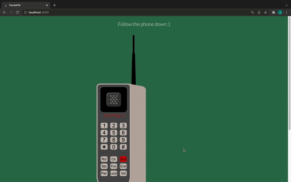

# Number to Word List Convertor

### What

React, Express and Node app - converts a given numeric string into a list of corresponding words in the style of [T9](<https://en.wikipe.ia.org/wiki/T9_(predictive_text)>) / [Phonewords](https://en.wikipedia.org/wiki/Phoneword).

## Demo

  
https://vimeo.com/659245138

**Currently Developed and optimised for a 1440 \* 700 screen - more accessibility coming soon**

### Why and How

My goals for this project were to practise and demonstrate my abilities as a Full Stack Node.js & React Engineer. I did this by attempting to do the following:

1. Writing high quality, readable, and scalable business logic, algorithms and backend REST APIs (Node.js, Express.js).
2. Hooking those APIs up to a pleasing UI (React, Material UI, Axios)

I also tried to mimic the process of a Commercial team as closely as possible whilst adhering to the nature of a solo project - I created, reviewed and merged Branches and Pull Requests.

In a Production environment, I would rebase my commits before pushing a PR or merge. I left my commits as they are during this project - to showcase my process.

## How to Use

To run locally:

1. Git clone:  
   `git@github.com:jai-jk/number-to-word-list-convertor.git` (SSH)  
   `https://github.com/jai-jk/number-to-word-list-convertor.git` (HTTPS)  
   `gh repo clone jai-jk/number-to-word-list-convertor` (GitHub CLI)
2. Start the server: In the terminal, navigate to the parent folder that you cloned the repo into and enter `cd number-to-word-list-convertor/server && npm i && npm start`
3. Start the React app: Open another terminal and navigate to the parent folder once more, type in `cd number-to-word-list-convertor/client && npm i && npm start`
4. Try the app out by visiting `http://localhost:3000/` in your browser!

## Features

- Single Page App.
- Enter a number into the textbox and a modal pops up with all of the possible words that number combination could produce within the T9 model.
- Words are matched according to a collection of the 500 most common words in the English Language, and any words generated that match to those are displayed. All of the other possible words are also displayed.
- Users can only enter numbers and the textfield is required - a flash notice is triggered if a user tries to circumvent either process.

## Roadmap

- Break backend code into functional components
- A More accessible and generally improved UI and UX
   - Scalability for multiple screen sizes (with ems and rems, breakpoints & media queries, etc)
   - Ease of use for all types of users (https://www.dreamhost.com/blog/make-your-website-accessible/)
   - Improvements to the modal
      - Close and Refresh functionality (X button, Escape keyDown, fluid refreshing)
      - Increase Width and improve Design
   - Refactor Styles
- A functioning keyboard on the brick phone.
- Deployment to Heroku or AWS.
- Unit, Functional, Feature and E2E Tests with Jest and Cypress.
- Migration to TypeScript.

### Dependencies

Server-Side Dependencies:

- [Cors](https://www.npmjs.com/package/cors)
- [Express](https://www.npmjs.com/package/express)
- [Morgan](https://www.npmjs.com/package/morgan)

Client-Side Dependencies:

- [emotion/react](https://www.npmjs.com/package/@emotion/react)
- [emotion/styled](https://www.npmjs.com/package/@emotion/styled)
- [material-ui/core](https://www.npmjs.com/package/@material-ui/core)
- [mui/icons-material](https://www.npmjs.com/package/@mui/icons-material)
- [mui/material](https://www.npmjs.com/package/@mui/material)
- [axios](https://www.npmjs.com/package/axios)
- [react](https://www.npmjs.com/package/react)
- [react-dom](https://www.npmjs.com/package/react-dom)
- [react-scripts](https://www.npmjs.com/package/react-scripts)
- [styled-components](https://www.npmjs.com/package/styled-components)
